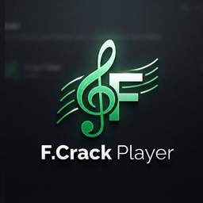

  

# F.Crack Player

### Reproductor de audio local para Windows · Local audio player for Windows

[**🌐 Sitio oficial / Official site**](https://yottomtnz.github.io/FCrack_Audio_Player/) · [**⬇️ Descargar / Download**](https://drive.google.com/file/d/1AJKtcF8FnFnocJlscRWS5nE4NRWx27hz/view?usp=drive_link)

**Autor / Author:** Fraudy Martinez Madruga  
**Versión / Version:** 1.0  
**Plataforma / Platform:** Windows

---

## 🇪🇸 Español

**F.Crack Player** es un reproductor de audio de escritorio para Windows centrado en música local, una interfaz oscura con acentos neón y controles rápidos sin depender de una cuenta o de una biblioteca en la nube.

El proyecto público de GitHub contiene la página oficial, documentación y recursos de presentación. **El código fuente de la aplicación no forma parte de este repositorio público.**

### ✨ Funciones principales

- **Arrastrar y soltar** archivos de audio o carpetas completas.
- Elección entre **crear una lista nueva** o **añadir música a la lista actual**.
- **Búsqueda rápida** por nombre dentro de la lista.
- Vista independiente de **favoritos**.
- Lectura de **artista y portada** desde metadatos cuando están disponibles.
- **Aleatorio** y repetición en tres estados: desactivada, lista completa o una sola pista.
- **9 perfiles de ecualización:** Flat, Bass & Treble, Club, Dance, Full Bass, Headphones, Live, Pop y Rock.
- Control de volumen de **0 a 150%**.
- Soporte para **teclas multimedia** del teclado: Play/Pause, Anterior y Siguiente.
- **Visualizador animado** y vinilo animado cuando la pista no incluye portada.
- Interfaz en **Español / English**.
- Ajuste de **transparencia** de la ventana.
- Personalización independiente del color de **contorno, interfaz y visualizador** con acentos cian, verde neón o violeta.
- Guarda localmente la lista, pista actual, posición, volumen, ecualización y preferencias visuales para continuar la sesión.
- Evita abrir múltiples instancias del reproductor y permite abrir archivos de audio desde Windows en la instancia existente.

### 🎧 Formatos reconocidos

`MP3` · `FLAC` · `WAV` · `OGG` · `M4A` · `WMA` · `AAC` · `OPUS`

### 💻 Instalación completa o portable

El instalador ofrece dos formas de usar F.Crack Player:

**Instalación completa**
- Instala el reproductor en Archivos de Programa.
- Crea accesos directos.
- Añade un desinstalador al sistema.
- Puede registrar F.Crack Player como opción para abrir formatos de audio.

**Versión portable**
- Extrae un único ejecutable en la carpeta elegida.
- Pensada para USB o uso sin instalación tradicional.
- No realiza la integración del modo completo con el sistema.

### 🔐 Privacidad

F.Crack Player está diseñado para reproducir archivos locales. No necesita una cuenta para funcionar y las listas/preferencias se guardan en el equipo. Consulta [PRIVACY.md](PRIVACY.md) para más detalles.

### 📥 Descarga

**[Descargar F.Crack Player desde Google Drive](https://drive.google.com/file/d/1AJKtcF8FnFnocJlscRWS5nE4NRWx27hz/view?usp=drive_link)**

---

## 🇬🇧 English

**F.Crack Player** is a Windows desktop audio player focused on local music, a dark neon-accented interface, and quick controls without requiring an account or a cloud library.

This public GitHub project contains the official website, documentation, and presentation assets. **The application's source code is not included in this public repository.**

### ✨ Main features

- **Drag and drop** audio files or entire folders.
- Choose between **starting a new list** or **adding music to the current list**.
- **Quick search** by name inside the playlist.
- Dedicated **favorites** view.
- Reads **artist and cover artwork** from metadata when available.
- **Shuffle** and three repeat states: off, repeat all, or repeat one.
- **9 equalizer presets:** Flat, Bass & Treble, Club, Dance, Full Bass, Headphones, Live, Pop, and Rock.
- **0–150%** volume control.
- Keyboard **media key support**: Play/Pause, Previous, and Next.
- **Animated visualizer** and animated vinyl when a track has no embedded artwork.
- **Spanish / English** interface.
- Adjustable window **transparency**.
- Independent **border, interface, and visualizer** accent colors with cyan, neon green, or purple choices.
- Locally remembers playlist, current track, position, volume, EQ, and visual preferences for session continuity.
- Prevents duplicate player instances and routes audio files opened from Windows to the existing instance.

### 🎧 Recognized formats

`MP3` · `FLAC` · `WAV` · `OGG` · `M4A` · `WMA` · `AAC` · `OPUS`

### 💻 Full installation or portable mode

The installer provides two ways to use F.Crack Player:

**Full installation**
- Installs the player into Program Files.
- Creates shortcuts.
- Adds a system uninstaller.
- Can register F.Crack Player as an option for opening audio formats.

**Portable version**
- Extracts a single executable to the folder you choose.
- Designed for USB drives or use without a traditional installation.
- Does not perform the full install's system integration.

### 🔐 Privacy

F.Crack Player is designed for local files. It does not require an account to operate, and playlists/preferences are stored on the computer. See [PRIVACY.md](PRIVACY.md) for details.

### 📥 Download

**[Download F.Crack Player from Google Drive](https://drive.google.com/file/d/1AJKtcF8FnFnocJlscRWS5nE4NRWx27hz/view?usp=drive_link)**

---

## Copyright

© 2026 **Fraudy Martinez Madruga**. All rights reserved.  
Third-party components remain subject to their respective licenses. See [THIRD_PARTY.md](THIRD_PARTY.md).
