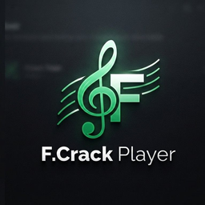

  

<h1 align="center">F.Crack Player</h1>

  <em>Tu música local, sin complicaciones. / Your local music, no strings attached.</em>

  
  
  
  
  

---

## Sobre / About

**ES** — **F.Crack Player** es un reproductor de audio de escritorio para Windows centrado en tu música local: interfaz oscura con acentos neón, controles rápidos y cero dependencia de cuentas o bibliotecas en la nube.

**EN** — **F.Crack Player** is a Windows desktop audio player built around your local music: a dark neon-accented interface, fast controls, and zero reliance on accounts or cloud libraries.

> **Nota / Note:** este repositorio público contiene la página oficial, la documentación y los recursos de presentación. **El código fuente de la aplicación no forma parte de este repositorio público.** / This public repository contains the official website, documentation, and presentation assets. **The application's source code is not included in this public repository.**

---

## ✨ Funciones / Features

<table>
<tr>
<td width="50%" valign="top">

### 🎵 Arrastrar y soltar / Drag & drop
Suelta archivos o carpetas completas. Crea una lista nueva o añade música a la actual.
Drop files or entire folders. Start a new list or add music to the current one.

</td>
<td width="50%" valign="top">

### 🔎 Búsqueda rápida / Quick search
Filtra la lista por nombre al instante, incluso con guiones, puntos o guiones bajos.
Instantly filter the list by name, even with dashes, dots, or underscores.

</td>
</tr>
<tr>
<td width="50%" valign="top">

### 💙 Favoritos / Favorites
Marca canciones con un toque y accede a una vista dedicada de favoritos.
Favorite songs with one tap and jump into a dedicated favorites view.

</td>
<td width="50%" valign="top">

### 🎚️ 9 perfiles de ecualización / 9 EQ presets
Flat, Bass & Treble, Club, Dance, Full Bass, Headphones, Live, Pop y Rock.
Flat, Bass & Treble, Club, Dance, Full Bass, Headphones, Live, Pop, and Rock.

</td>
</tr>
<tr>
<td width="50%" valign="top">

### ⌨️ Teclas multimedia / Media keys
Play/Pause, Anterior y Siguiente desde el teclado.
Play/Pause, Previous, and Next from your keyboard.

</td>
<td width="50%" valign="top">

### ✨ Estilo personalizable / Custom style
Acentos neón (cian, verde neón, violeta) para contorno, interfaz y visualizador, más transparencia ajustable e idioma ES/EN.
Neon accents (cyan, neon green, purple) for border, interface, and visualizer, plus adjustable transparency and ES/EN language.

</td>
</tr>
<tr>
<td width="50%" valign="top">

### 📀 Metadatos y visualizador / Metadata & visualizer
Artista y portada desde los metadatos; visualizador animado y vinilo animado sin portada.
Artist and cover from metadata; animated visualizer and animated vinyl when there's no artwork.

</td>
<td width="50%" valign="top">

### 💾 Memoria de sesión / Session memory
Guarda lista, pista, posición, volumen, ecualización y preferencias en tu equipo. Una sola instancia.
Saves playlist, track, position, volume, EQ, and preferences on your PC. Single instance.

</td>
</tr>
</table>

> ### 🔊 Volumen 0–150% y repetición total
> **ES** — Control de volumen ampliado de 0 a 150%, aleatorio y tres modos de repetición: desactivada, lista completa o una sola pista.
> **EN** — Extended 0–150% volume control, shuffle, and three repeat modes: off, repeat all, or repeat one.

---

## 🎧 Formatos / Formats

  
  
  
  
  
  
  
  

---

## 💻 Instalación / Installation

<table>
<tr>
<td width="50%" valign="top">

### 🖥️ Instalación completa / Full install
- Instala en Archivos de Programa / Installs into Program Files.
- Crea accesos directos y desinstalador / Creates shortcuts and an uninstaller.
- Puede registrar formatos de audio / Can register audio formats.

</td>
<td width="50%" valign="top">

### 🎒 Portable / Portable mode
- Un único ejecutable en la carpeta que elijas / A single executable in the folder you choose.
- Ideal para USB o sin instalación / Great for USB drives or no-install use.
- Sin integración con el sistema / No system integration.

</td>
</tr>
</table>

---

## 🔐 Privacidad / Privacy

**ES** — F.Crack Player reproduce archivos locales. No necesita cuenta y las listas y preferencias se guardan en tu equipo. Detalles en [PRIVACY.md](PRIVACY.md).

**EN** — F.Crack Player plays local files. No account needed; playlists and preferences stay on your computer. Details in [PRIVACY.md](PRIVACY.md).

---

## ⬇️ Descarga / Download

  

---

## Copyright

© 2026 **Fraudy Martinez Madruga**. All rights reserved.
Third-party components remain subject to their respective licenses. See [THIRD_PARTY.md](THIRD_PARTY.md).
